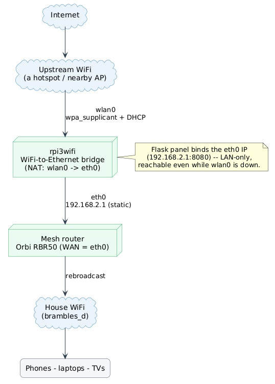

# WiFi Switcher — a Raspberry Pi WiFi-to-Ethernet bridge

Turn a Raspberry Pi into a **WiFi-to-Ethernet bridge** so a mesh router (Orbi,
Deco, eero, …) that only takes its internet feed over its **Ethernet WAN port**
can be fed from a nearby **WiFi** network instead — no SIM/GSM/4G router
required. A small LAN-only web panel lets you see and switch the upstream WiFi
from any browser in the house, with no SSH.

---

## The problem it solves

Mesh routers expect a wired internet feed: you plug an Ethernet cable from a
modem/ONT into their WAN port and they rebroadcast it around the house. But
sometimes the only internet you have is **WiFi** — a neighbour's/landlord's AP,
a campsite or marina WiFi, a holiday-let router in another building, an upstream
AP on the far side of a property — and there is no wired drop to plug in.

The usual fix is a **4G/5G SIM router**, but that needs a SIM, a data plan, and
decent cellular coverage. If you already have usable WiFi nearby, that's wasteful.

This project bridges the gap literally:



- **`wlan0`** associates to an upstream WiFi to get internet (driven by
  `wpa_supplicant`), with `iptables` NAT `MASQUERADE -o wlan0`.
- **`eth0`** is a static gateway (`192.168.2.1`) plugged into the mesh router's
  WAN port; the mesh router does DHCP/NAT for the house exactly as if it were
  wired to a modem.
- Traffic is **routed + NAT'd** from `eth0` out through `wlan0`, so the whole
  house gets internet over a WiFi uplink.

**The catch this panel fixes:** when the upstream WiFi drops or you move within
range of a different network, `wlan0` is left unassociated and the entire house
loses internet. Re-pointing it normally means SSHing into a headless Pi. This
panel makes switching a one-click job from any browser — and adds automatic
failover so it usually heals itself.

**Why the panel stays reachable during an outage:** the web server binds to the
`eth0` side (`192.168.2.1`), which is independent of `wlan0`. Even when the
upstream WiFi is completely down, you can still open the panel from the house
network and switch to a working network.

---

## Features

**Upstream link control (no SSH)**
- See the current upstream network, signal/IP, association state, and live
  internet reachability.
- **Scan** for nearby networks (deduped per SSID, strongest signal first, with
  security type), **connect** to a saved one, **add** a new one (WPA2/WPA3 or
  open, including hidden SSIDs), and **forget** networks.
- Non-ASCII SSIDs (e.g. *Evanna’s iPhone*) are decoded and shown correctly.
- Switching runs in a background worker: associate → DHCP → verify connectivity,
  with live progress and clear errors surfaced in the UI.

**Automatic failover & roaming**
- A background monitor watches internet reachability; after a sustained outage
  (default ~2 min) it scans and **auto-switches to the strongest saved network
  that is actually pingable**, not just one that associates.
- **Auto-connect** toggle: when on, all saved networks stay enabled so
  `wpa_supplicant` roams/falls back on its own; when off, only the current
  network stays enabled (manual-only, never switches itself).
- **Preference policy**: *List order* (drag-rank saved networks with ▲▼; highest
  rank wins when multiple are in range) or *Strongest signal* (flatten
  priorities and just take the strongest AP). Persisted into
  `wpa_supplicant.conf` so it survives reboots.
- **Phone-hotspot delay/countdown**: set a delay before a switch so you can
  enable Personal Hotspot after pressing Connect.

**Connection quality & data usage**
- Per-minute background sampler records **ping latency** and a light **download
  speed** test (sized + configurable, ~150 KB/min by default; can be disabled),
  shown as "1 minute ago" with no probing in the request path.
- **Data usage accounting** that survives process/interface resets: live
  rx/tx, all-time totals, and per-week/month/year history, with a **per-network
  breakdown** charted over time.
- Counter-reset / misread guards prevent phantom-traffic spikes; atomic writes
  with `.bak` fallback and dated weekly snapshots protect the stats file.

**Resilience & diagnostics**
- **wlan0 supplicant launcher** (`wifi-connect`) that keeps `wpa_supplicant`
  alive even when no saved AP is in range (so the control socket — and therefore
  the panel — never disappears).
- **Self-healing watchdog** (`wifi-watchdog`, every minute) restarts the
  launcher if the control socket goes away.
- **One-click diagnostics**: `GET /api/debug` (and the `netdebug` CLI) emit an
  identical secret-free report (process/socket/unit state, logs, links, routes,
  scan results, internet probe). Reachable on `eth0` even when wlan0 is down; the
  panel links to it on error.

**Security**
- **LAN-only by design**: the server binds to the `eth0` IP only, so it is never
  offered on the upstream WiFi; `install.sh` also adds an `iptables` DROP on
  `wlan0:PORT` as defense in depth.
- Diagnostics never print PSKs. No authentication (per requirements) — anyone on
  the house network can use it.

---

## Architecture

See **[docs/ARCHITECTURE.md](docs/ARCHITECTURE.md)** for the full breakdown
(module map, threads, data flow, the wpa_supplicant interaction model, and the
boot-race / supplicant-survival design). In brief:

- **`app.py`** — Flask app + JSON API; background **switch worker**,
  **auto-failover worker**, and **failover monitor** threads.
- **`wifi.py`** — thin `wpa_cli` wrapper (status, scan, add/select/forget,
  priority/enable policy, `save_config`).
- **`net.py`** — interface IP/carrier/bytes, internet probe, ping, sized speed
  test, DHCP client auto-detect + renew.
- **`netquality.py`** — per-minute ping/speed sampler thread.
- **`persist_stats.py`** — durable all-time + per-period + per-SSID byte
  accounting with reset/misread guards.
- **`diag.py`** — the no-secrets diagnostic bundle.
- **`config.py` / `settings.py`** — env-var config / persisted auto-connect
  policy (`settings.json`).
- **System glue** — `wifi-connect.{sh,service}` (supplicant launcher),
  `wifi-watchdog.{sh,service,timer}` (self-heal), `networkswitcher.service`
  (the panel), `netdebug.sh` (CLI diagnostics).

---

## Requirements

- A Raspberry Pi (built/tested on a Pi 3, hostname `rpi3wifi`) with **both** a
  WiFi interface (`wlan0`) and Ethernet (`eth0`).
- Raspberry Pi OS / Debian with `wpasupplicant`, a DHCP client
  (`dhcpcd`/`dhclient`/`udhcpc`), `iptables`, `python3`, and `iw`.
- `wpa_supplicant` configured for `wlan0` with a control socket and
  `update_config=1` (so the panel can `save_config`). Default conf path:
  `/etc/wpa_supplicant/wpa_supplicant-wlan0.conf` — it must contain:

  ```
  ctrl_interface=DIR=/var/run/wpa_supplicant GROUP=netdev
  update_config=1
  ```

- A static IP on `eth0` (default `192.168.2.1`) and IPv4 forwarding + NAT from
  `eth0` out `wlan0`. The bridge plumbing itself (static `eth0`, `MASQUERADE`,
  `net.ipv4.ip_forward=1`) is assumed to already exist; this app does **not**
  configure the NAT/bridge — it only controls which WiFi `wlan0` joins. See
  [docs/ARCHITECTURE.md](docs/ARCHITECTURE.md) for the exact bridge setup.

---

## Install (on the Pi)

### 1. Authorize the Pi to clone from GitHub

The Pi needs its own SSH key registered with GitHub (one-time; won't affect your
other keys):

```bash
# Generate a key on the Pi
ssh pi@192.168.2.1 "ssh-keygen -t ed25519 -C 'pi@networkswitcher' -N '' -f ~/.ssh/id_ed25519"
# Print the public key
ssh pi@192.168.2.1 "cat ~/.ssh/id_ed25519.pub"
```

Paste the output into **GitHub → Settings → SSH and GPG keys → New SSH key**.

### 2. Clone and install

```bash
ssh pi@192.168.2.1
git clone git@github.com:calapor/networkswitcher networkswitcher
cd networkswitcher
sudo ./install.sh
```

`install.sh`:
1. **Preflight** — checks `wpa_cli` reaches `wpa_supplicant` on `wlan0` and
   detects a DHCP client.
2. Installs the **supplicant launcher + self-healing watchdog**
   (`wifi-connect`, `wifi-watchdog`) and their systemd units, and enables them.
3. Copies the app to `/opt/networkswitcher`, creates a virtualenv, installs
   deps (gracefully continues offline if Flask is already present).
4. Installs and starts the **`networkswitcher`** service.
5. Adds the defense-in-depth `iptables` DROP on `wlan0:PORT`.

> Note: you should also **mask** the stock `wpa_supplicant.service` and
> `wpa_supplicant@wlan0.service` so they don't fight the launcher on boot — see
> [docs/ARCHITECTURE.md](docs/ARCHITECTURE.md#boot-race--supplicant-survival).

### 3. Open the panel

From any device on the house WiFi:

```
http://192.168.2.1:8080
```

---

## Deploying updates

```bash
ssh pi@192.168.2.1
cd ~/networkswitcher
git pull          # fetch latest from GitHub
sudo ./install.sh # copy files to /opt and restart the service
```

Both steps are always needed: `git pull` updates the local clone, `install.sh`
copies into `/opt/networkswitcher` and restarts the service. Check it came up:

```bash
sudo systemctl status networkswitcher
```

---

## Configuration

Settings are environment variables (set in `networkswitcher.service`):

| Variable | Default | Purpose |
|----------|---------|---------|
| `WIFI_IFACE` | `wlan0` | Upstream interface to switch |
| `BIND_HOST` | `192.168.2.1` | Bind address (eth0/LAN side only) |
| `PORT` | `8080` | Web port |
| `WPA_CONF` | `/etc/wpa_supplicant/wpa_supplicant-wlan0.conf` | Config for `save_config` |
| `DHCP_CMD` | _(auto)_ | Explicit DHCP command, e.g. `dhclient -1 {iface}` |
| `ASSOC_TIMEOUT` / `DHCP_TIMEOUT` | `30` / `20` | Switch timeouts (s) |
| `PROBE_HOST` / `PROBE_PORT` | `1.1.1.1` / `53` | Internet reachability probe (TCP connect) |
| `QUALITY_INTERVAL` | `60` | Ping/speed sample interval (s) |
| `SPEEDTEST_BYTES` | `150000` | Bytes per speed sample (`0` disables speed test) |
| `SPEEDTEST_URL` | Cloudflare `__down` | Sized-download endpoint (`{n}` = bytes) |
| `FAILOVER_CHECK_INTERVAL` / `FAILOVER_FAILS` | `20` / `6` | Outage detection: interval × fails ≈ time before auto-switch (~2 min) |

If the wrong DHCP client is auto-picked, set `DHCP_CMD` in the service file and
`sudo systemctl restart networkswitcher`.

---

## Switching to a phone hotspot

A phone hotspot is awkward because **the phone that becomes the hotspot can never
load this panel**: reaching `192.168.2.1` requires being on the house WiFi
(`houseWifi`), but turning on Personal Hotspot drops the phone off `houseWifi`
and moves it to the *upstream* side, behind the bridge's NAT, where the panel
isn't served. Three ways to handle it:

- **Auto-fallback (cleanest).** Save the hotspot once. After any switch the app
  re-enables every saved network, so `wpa_supplicant` auto-roams to the hotspot
  whenever the current upstream drops and the hotspot is up and in range. Turn
  the hotspot on and wait ~15–30s — no panel interaction needed.
- **Delay / countdown.** In *Saved networks* set a **Delay (s)**, press
  **Connect**, then enable the hotspot during the countdown.
- **Second device.** Drive the panel from a laptop/another phone on
  `houseWifi`; the bridge keeps that side alive while it swaps its upstream.

---

## Troubleshooting

- **Panel up but no internet** — open `http://192.168.2.1:8080/api/debug` (or run
  `sudo netdebug` on the Pi) and read/paste the report. It shows supplicant
  state, scan results, links, routes and the internet probe — no secrets.
- **wlan0 won't associate** — check the password and that the network is in
  range; the switch error message says which step failed.
- **`wpa_cli` can't reach the supplicant** — `pgrep -a wpa_supplicant` should
  show exactly one process (the `wifi-connect -B` instance). The watchdog
  restarts the launcher within a minute; ensure the stock `wpa_supplicant*`
  units are masked (see ARCHITECTURE).
- **Phantom data-usage spike** — fixed in `persist_stats.py`; repair an already
  corrupted `stats.json` with `fix_phantom.py`, or reset period anchors with
  `reset_anchors.py` (stop the service first; instructions in each script).

---

## Local development

```bash
python3 -m venv venv && ./venv/bin/pip install -r requirements.txt
BIND_HOST=127.0.0.1 ./venv/bin/python app.py
```

`wpa_cli`/`ip`/DHCP calls fail off-Pi (the UI shows the errors), but the page,
scan/add forms, charts and the whole API shape are exercisable.

---

## Acknowledgements

- **[Chart.js](https://www.chartjs.org/)** (MIT License) — bundled in `static/chart.umd.min.js`
</content>
